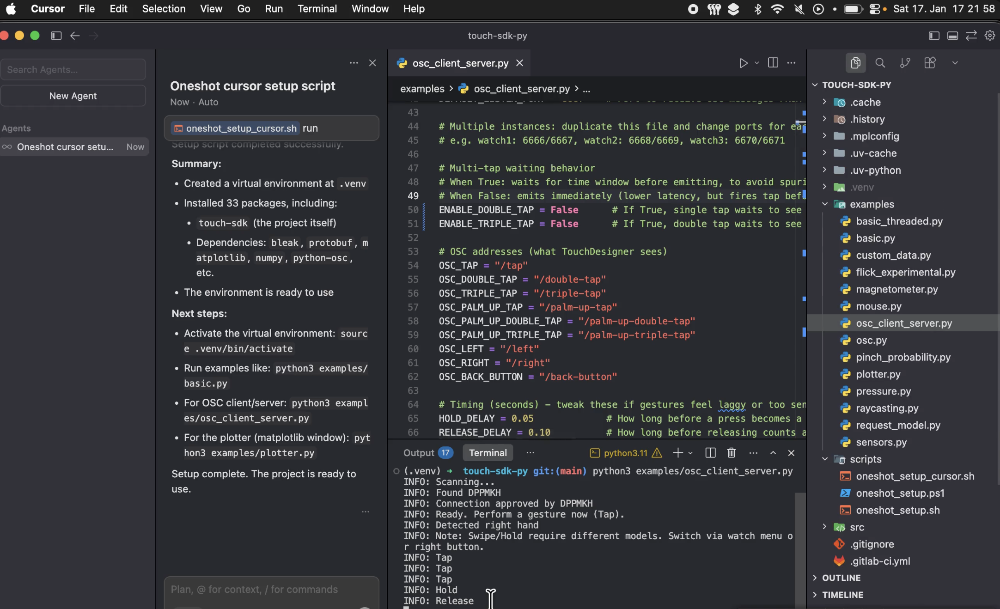

# Touch SDK py


Connects to Doublepoint Touch SDK compatible Bluetooth devices – like [this Wear OS app](https://play.google.com/store/apps/details?id=io.port6.watchbridge).

There is also a [JavaScript SDK](https://www.npmjs.com/package/touch-sdk) and a [Unity SDK](https://openupm.com/packages/io.port6.sdk/).

See [docs.doublepoint.com](https://docs.doublepoint.com/docs/touch-sdk) for more info.

## Installation

```sh
pip install touch-sdk
```

## Quick Setup (recommended)

[](scripts/doublepoint_touchsdk_py_oneshot_setup.mp4)

*👆 Click image to watch setup video*

One command to set up Python 3.11, venv, and all dependencies:

**macOS / Linux:**
```sh
bash scripts/oneshot_setup_cursor.sh
```

**Windows (PowerShell):**
```powershell
powershell -ExecutionPolicy Bypass -File .\scripts\oneshot_setup.ps1
```

After setup, run examples:
```sh
python examples/basic.py
python examples/osc_client_server.py
python examples/plotter.py
```

## Example Usage

```python
from touch_sdk import Watch, GestureType

class MyWatch(Watch):
    def on_gesture(self, gesture):
        if gesture == GestureType.PINCH_TAP:
            print('Tap')

watch = MyWatch()
watch.start()
```


## API Reference

All callbacks are methods in a class that inherits `Watch`.

Optional name filter (case insensitive):
```python
watch = MyWatch('device-name')
```

### Gestures (Tap, Swipe, Hold, etc.)
```python
from touch_sdk import GestureType

def on_gesture(self, gesture):
    if gesture == GestureType.DPAD_LEFT:
        print('swipe left')
    elif gesture == GestureType.DPAD_RIGHT:
        print('swipe right')
    elif gesture == GestureType.PINCH_HOLD:
        print('hold')
    elif gesture == GestureType.PINCH_TAP:
        print('tap')
```

Note: Swipe and Hold require different gesture models. Switch via watch menu or right hardware button.

### Gesture Probability
```python
def on_gesture_probability(self, probabilities):
    print(probabilities)  # dict of GestureType -> float (0-1)
```

### Sensors
```python
def on_sensors(self, sensors):
    print(sensors.acceleration)    # (x, y, z)
    print(sensors.gravity)         # (x, y, z)
    print(sensors.angular_velocity) # (x, y, z)
    print(sensors.orientation)     # (x, y, z, w)
```

### Touch Screen
```python
def on_touch_down(self, x, y):
    print('touch down', x, y)

def on_touch_up(self, x, y):
    print('touch up', x, y)

def on_touch_move(self, x, y):
    print('touch move', x, y)
```

### Rotary Dial
```python
def on_rotary(self, direction):
    print('rotary', direction)  # +1 clockwise, -1 counter-clockwise
```

### Back Button
```python
def on_back_button(self):
    print('back button')
```

### Haptics
```python
watch.trigger_haptics(1.0, 300)  # intensity (0-1), duration (ms)
```

### Properties
```python
watch.hand                    # Hand.NONE, Hand.LEFT, Hand.RIGHT
watch.battery_percentage      # 0-100
watch.touch_screen_resolution # (width, height) or None
watch.haptics_available       # True if supported
```

### Multiple OSC Instances

To connect multiple watches, duplicate `examples/osc_client_server.py` and change ports:
- Watch 1: ports 6666/6667
- Watch 2: ports 6668/6669
- Watch 3: ports 6670/6671


## Unity Backend

The `stream_watch` module can serve as backend for touch-sdk-unity (>=0.12.0) in Play Mode. Set the python path in `BluetoothWatchProvider` to your venv's python executable.

## Troubleshooting

If things don't work, try turning Bluetooth off and on again. This fixes many issues on Linux, Mac, and Windows.

